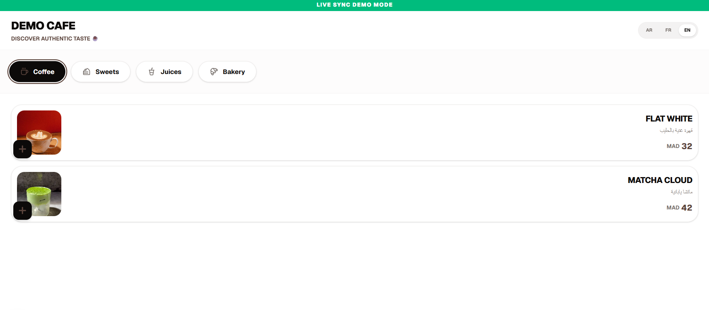
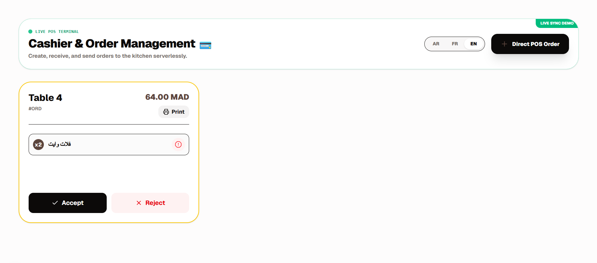
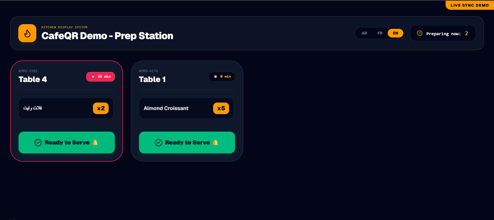
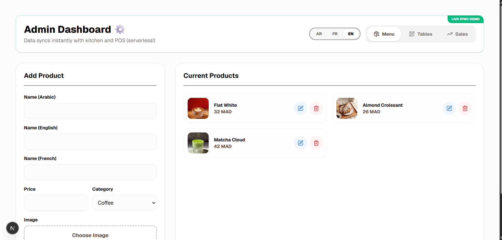
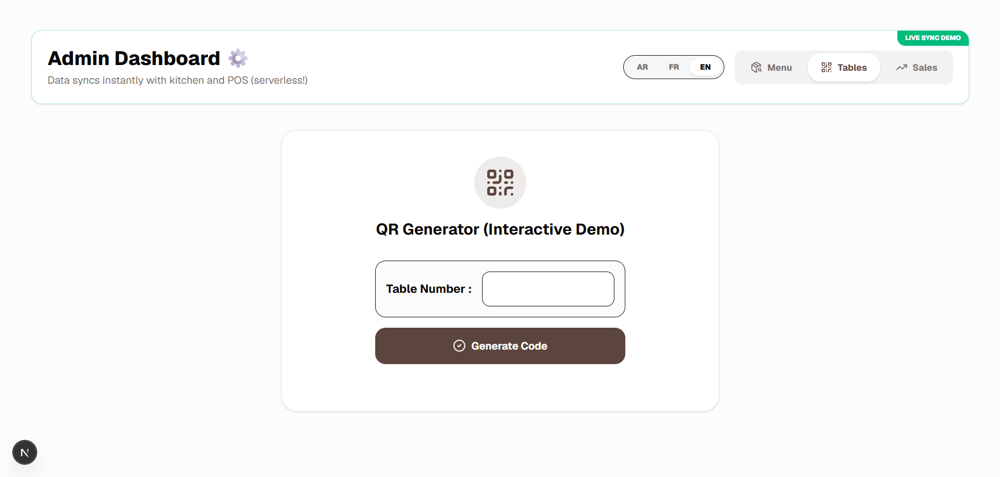
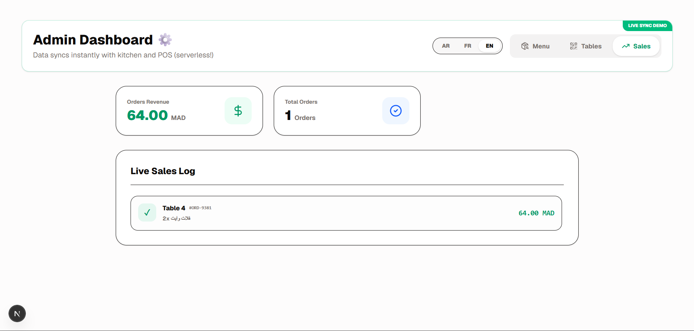

> [!WARNING]
> **Proprietary and Not Open Source**
>
> This repository is a private, proprietary portfolio showcase for **CafeQR SaaS**. It is provided for high-level technical review only. Unauthorized copying, modification, redistribution, reverse engineering, resale, or commercial use of any part of this codebase is strictly prohibited. All rights are reserved.

<div align="center">

# CafeQR SaaS

### The Premium QR Menu, POS Cashier, Kitchen Printing, and Multi-Tenant Control Platform for Modern Cafes


**Live Platform:** [cafeqr.egokam.site](https://cafeqr.egokam.site)

</div>

---

## ✦ Platform Overview

**CafeQR SaaS** is a premium, mobile-first hospitality platform built for cafes that want a polished digital ordering experience without sacrificing operational speed.

It combines a dynamic QR menu, walk-in POS ordering, automatic kitchen receipt printing, tenant administration, subscription control, and a private SaaS factory into one cohesive Next.js application. Every cafe runs through a tenant slug, allowing one production codebase to serve many isolated cafe instances.

> **Design intent:** fast enough for daily service, elegant enough for premium hospitality, and structured enough to scale as a serious SaaS product.

---

## ✦ Experience Preview

Add polished screenshots or GIFs here when preparing the GitHub showcase:

| Surface | Preview |
| --- | --- |
| Guest QR Menu |  |
| POS Cashier |  |
| Kitchen Receipt Printing |  |
| Cafe Admin (Menu & Products) |  |
| Cafe Admin (Sales & Analytics) |  |
| Cafe Admin (QR Table Generation) |  |

---

## ✦ Core Product Suite

### 🧾 Dynamic QR Menus

Guests scan a table-specific QR route and enter a fast, app-like menu experience. The menu supports Arabic, French, and English labels, category filtering, real-time product availability, active order tracking, and direct order cancellation while an order is still pending.

The production route validates the cafe slug, table record, subscription state, and customer session before allowing orders to flow into Supabase.

### 💳 Omnichannel POS Cashier

The cashier terminal is designed for both QR-driven and walk-in service. Cashiers can accept or reject guest orders, print receipts, mark products out of stock, and create manual POS orders that go directly to the kitchen as accepted orders.

Cashier access is PIN-protected and includes failed-attempt lockout behavior, subscription heartbeat checks, realtime order subscriptions, audible alerts, and presence-based terminal limits per cafe plan.

### 🖨️ Automatic Kitchen Receipt Printing

Accepted orders are instantly printed on the dedicated kitchen thermal printer, allowing kitchen staff to begin preparation immediately without requiring an additional display.

Each receipt includes the table number, ordered items, quantities, notes, and timestamps. Printing occurs only after cashier approval, ensuring the kitchen receives confirmed orders while the POS remains the central hub for order management and status updates.

### 🏛️ Cafe Admin Console

Each cafe owner gets a private admin surface for product management, multilingual menu entries, compressed image uploads, QR table generation, monthly sales review, settings, staff PIN updates, device limits, and subscription billing.

The admin login flow verifies the owner email against the cafe record before granting access, and includes OTP/password recovery flows through Supabase Auth.

### ⚜️ SaaS Master Control Factory

The private operator console acts as the SaaS command center. It verifies a whitelisted super-admin account, loads global cafe KPIs, tracks tenant subscription states, audits payment receipts, provisions new cafe instances, updates owner credentials, forces subscription changes, and performs full tenant deletion when required.

This is the operational layer that turns CafeQR from a single cafe app into a multi-tenant SaaS platform.

---

## ✦ Architecture Highlights

**Multi-tenant routing:** tenant surfaces live under `src/app/[cafeSlug]`, including admin, cashier, kitchen, and table-specific QR menu routes.

**Supabase-backed isolation:** tenant data is keyed by cafe records, slugs, table ids, products, orders, receipts, owner auth ids, and subscription status.

**Realtime operations:** Guest orders arrive instantly in the POS through Supabase Realtime. Once accepted, the system automatically prints a kitchen receipt while the POS continues managing the complete order lifecycle.

**Session fingerprinting:** middleware issues an HTTP-only `cafe_lux_session` cookie, while guest ordering also uses a browser-side client session id to track active orders per visitor.

**Subscription enforcement:** tenant routes call subscription checks and run heartbeat validation, allowing the platform to suspend guest menus, cashier terminals, and kitchen printing when a cafe is expired or suspended.

---

## ✦ Security & Infrastructure

> **Security posture:** the platform uses a layered approach across middleware headers, Supabase Auth, server actions, tenant checks, PIN controls, presence limits, and subscription state enforcement.

| Layer | Implementation |
| --- | --- |
| HTTP security headers | `X-Frame-Options: DENY`, `X-Content-Type-Options: nosniff`, and `Referrer-Policy: strict-origin-when-cross-origin` |
| Session fingerprinting | `cafe_lux_session` cookie with `httpOnly`, `sameSite: lax`, production-only `secure`, and 12-hour lifetime |
| Tenant validation | Cafe slug and table validation before guest ordering |
| Admin authorization | Owner email verification against the cafe record plus Supabase Auth session checks |
| Staff authorization | PIN verification for cashier and kitchen access |
| Super-admin protection | Whitelisted owner portal plus server-side token verification |
| Deployment posture | Next.js standalone output, PM2 process management, and Caddy reverse proxy readiness |
| Media sources | Remote image patterns restricted to Unsplash and the configured Supabase project host |

---

## ✦ Technology Stack

| Area | Stack |
| --- | --- |
| Framework | Next.js 16.2.9 App Router, React 19 |
| Language | TypeScript |
| Styling | Tailwind CSS 4, shadcn/Radix primitives, lucide-react icons |
| Database & Auth | Supabase PostgreSQL, Supabase Auth, Supabase Storage, Supabase Realtime |
| State | Zustand cart store and localStorage-backed demo store |
| Motion & UX | Framer Motion, realtime audio alerts, mobile-first RTL interface |
| QR | `react-qr-code` |
| Deployment | Standalone Next.js build, PM2, Caddy, VPS-ready production profile |

---

## ✦ Project Structure

```text
CafeQrSaaS/
├── middleware.ts
├── next.config.ts
└── src/
    ├── actions/
    │   ├── auth.ts              # Owner auth, PIN checks, menu mutations, order status, table creation
    │   └── saas.ts              # Subscription checks, billing receipts, factory provisioning, super-admin data
    ├── app/
    │   ├── page.tsx             # Premium public landing experience
    │   ├── layout.tsx           # RTL root shell, fonts, metadata, viewport theme
    │   ├── globals.css          # Tailwind theme tokens and global app styling
    │   ├── get-started/
    │   │   └── page.tsx         # Plan selection and contact CTA
    │   ├── demo/
    │   │   ├── admin/page.tsx   # LocalStorage demo admin
    │   │   ├── client/page.tsx  # LocalStorage demo guest QR menu
    │   │   ├── kitchen/page.tsx # LocalStorage demo KDS
    │   │   └── pos/page.tsx     # LocalStorage demo POS cashier
    │   ├── ego-owner-9539/
    │   │   ├── login/page.tsx   # Restricted super-admin login and OTP flow
    │   │   └── page.tsx         # SaaS Master Control Factory
    │   └── [cafeSlug]/
    │       ├── admin/page.tsx   # Tenant admin console
    │       ├── cashier/page.tsx # Tenant POS cashier terminal
    │       ├── kitchen/page.tsx # Kitchen receipt printing configuration
    │       └── [tableNumber]/
    │           └── page.tsx     # Guest-facing QR menu and ordering flow
    └── lib/
        ├── supabase.ts          # Browser Supabase client
        ├── demoStore.ts         # Shared local demo products/orders store
        └── utils.ts             # Tailwind class merge helper
```

---

## ✦ Key Workflows

### Guest QR Order Flow

1. Guest scans `/{cafeSlug}/{tableNumber}`.
2. The app signs in anonymously when needed.
3. Subscription, cafe, and table validity are checked.
4. Active products are loaded for the tenant.
5. Guest submits an order with a session id.
6. POS receives the order in realtime for approval.
7. Guest tracks order status until ready, completed, rejected, or cancelled.

### POS to Kitchen Printing Flow

1. Cashier unlocks the terminal with the cafe PIN.
2. Supabase presence checks whether the cafe has available cashier seats.
3. Pending guest orders can be accepted or rejected.
4. Walk-in orders can be created from the POS drawer.
5. Accepted orders are automatically printed on the connected kitchen thermal printer.
6. Kitchen staff prepares the order using the printed receipt.
7. Cashier updates the order to Ready and Completed while printing the customer receipt when needed.

### SaaS Factory Flow

1. Super-admin signs into the private owner portal.
2. The server validates the access token and super-admin email.
3. A new cafe is provisioned with slug, owner auth account, plan, trial window, staff PINs, and device limits.
4. The platform generates ready-to-share admin, cashier, and kitchen links.
5. Subscription state, credentials, receipts, and tenant lifecycle can be managed centrally.

---

## ✦ Live Interactive Demo

Experience the product from each role:

**Explore:** [https://cafeqr.egokam.site](https://cafeqr.egokam.site)

Suggested showcase paths:

- Guest menu demo: `https://cafeqr.egokam.site/demo/client`
- POS demo: `https://cafeqr.egokam.site/demo/pos`
- Kitchen demo: `https://cafeqr.egokam.site/demo/kitchen`
- Admin demo: `https://cafeqr.egokam.site/demo/admin`

> Demo views use a browser-local synchronized store so reviewers can experience the end-to-end flow without production tenant credentials.

---

## ✦ Installation & Deployment

> [!IMPORTANT]
> These commands are included for technical review and deployment context only. This project remains proprietary and is not licensed for public reuse.

```bash
git clone https://github.com/yourusername/CafeQRSaaS.git
cd CafeQRSaaS
npm install
npm run build
pm2 start npm --name "cafeqr" -- start
```

Recommended production profile:

- Build with Next.js standalone output.
- Run the Node process under PM2.
- Reverse proxy through Caddy with HTTPS.
- Configure Supabase environment variables for public client access and server-side service-role actions.
- Keep super-admin credentials, service-role keys, and production secrets outside source control.

---

## ✦ Roadmap

- Advanced analytics dashboard with peak hours, revenue breakdowns, and product performance.
- AI-assisted menu descriptions and demand forecasting.
- Multi-currency support and deeper localization.
- Custom domain onboarding for premium tenants.
- Expanded billing automation and receipt review workflows.

---

## ✦ Business Requirements

CafeQR SaaS is designed to run with minimal hardware, making it suitable for small and medium-sized cafes without requiring specialized infrastructure.

| Component | Requirement |
| --- | --- |
| 🖨️ Kitchen Receipt Printer | ESC/POS-compatible thermal receipt printer for automatic kitchen order printing after cashier approval. |
| 💳 POS Terminal | Windows PC, laptop, tablet, or touchscreen device running a modern web browser. A thermal receipt printer is recommended for customer receipts. |
| 🏛️ Admin Console | Laptop or tablet (recommended) for the best management experience. The responsive interface also supports modern smartphones for day-to-day administration. |
| 🌐 Internet Connection | Stable internet connection for realtime order synchronization and cloud services. |
| 📱 Guest Devices | Any smartphone capable of scanning QR codes and opening a modern web browser. |

> **Recommended setup:** One POS device connected to a kitchen thermal printer, plus one laptop or tablet for administration. Cafe owners can also access the admin console from their phone whenever needed.

---

## ✦ Contact & Partnership

For cafe owners, technical partners, or premium SaaS inquiries:

**Instagram:** [@w.zd7](https://www.instagram.com/w.zd7)  
**Email:** [egokam.business@gmail.com](mailto:egokam.business@gmail.com)  
**WhatsApp:** [+212 781 991 384](https://wa.me/212781991384)

---

## ✦ License & Usage Restrictions

**CafeQR SaaS is proprietary and confidential.**

This repository is showcased solely as a portfolio artifact to demonstrate product architecture, UI execution, and SaaS engineering capability. No license is granted for personal use, public distribution, derivative work, resale, or commercial deployment.

**All rights reserved.**
